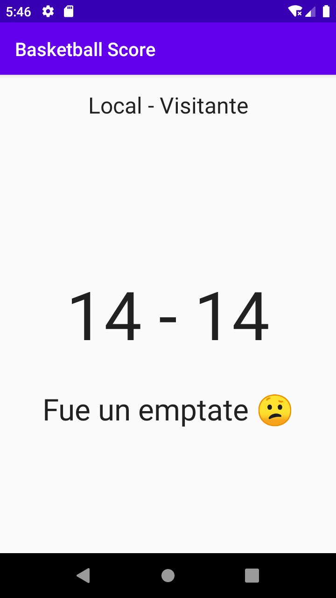

# Basketball Score
Esta aplicación es parte del curso [Android Completo con Kotlin](https://hackaprende.com/pagina-de-inicio/cursos/android-completo-con-kotlin/)

Con este ejercicio aprenderás los siguientes temas sobre Android:
- Entenderás el Activity lifecycle.
- Conocerás qué es un ViewModel y cómo implementarlos.
- Conocerás LiveData.

Así luce la app terminada:



### Instalación

Instala la aplicación con los siguientes pasos:

**Paso 1: Clona el repo**

Usa esto en tu terminal para clonar tu repositorio:
```bash
git clone https://github.com/hackaprende/android-kotlin-basketball-score.git
```
También puedes descargarla como Zip

**Paso 2: Has checkout al branch ‘starter’ **

El proyecto tiene dos branches: starter es para que tú mismo(a) desarrolles la app y master es la app ya terminada, para
trabajar con uno u otro escribe lo siguiente en la terminal
```bash
git checkout starter
```
El branch de starter solo mostrará un texto "Hello world" en una pantalla blanca.

**Paso 3: Ejecuta el proyecto y revisa que funcione correctamente**

Abre el proyecto en Android Studio y ejecútalo con el botón "run"
